p8105 hw6 yt2785
================
Yijing Tao (UNI yt2785)
Nov 2021

``` r
library(tidyverse)
library(modelr)
library(mgcv)

set.seed(1)
```

## Problem 1

Read and clean the data.

``` r
#read csv
birthweight_df = 
  read_csv("./birthweight.csv") %>% 
  mutate(
    babysex = recode(babysex, '1' = "male", '2' = "female"),
    babysex = as.factor(babysex),
    frace = recode(frace, '1' = "white", '2' = "black", '3' = "asian", '4' = "puerto_rican", '8' = "other", '9' = "unknown"),
    frace = as.factor(frace),
    malform = recode(malform, '0' = "absent", '1' = "present"),
    malform = as.factor(malform),
    mrace = recode(mrace, '1' = "white", '2' = "black", '3' = "asian", '4' = "puerto_rican", '8' = "other"),
    mrace = as.factor(mrace)
  )
```

    ## Rows: 4342 Columns: 20

    ## -- Column specification --------------------------------------------------------
    ## Delimiter: ","
    ## dbl (20): babysex, bhead, blength, bwt, delwt, fincome, frace, gaweeks, malf...

    ## 
    ## i Use `spec()` to retrieve the full column specification for this data.
    ## i Specify the column types or set `show_col_types = FALSE` to quiet this message.

``` r
#check whether there are missing datas
na_bwt = any(is.na(birthweight_df))
```

Transform `babysex`, `frace`, `malform` and `mrace` variables into
factor variables. And the answer of having missing data or not is FALSE,
which means there is no missing data in this data set.

*Make the plots showing all of the relationships between numeric
variables and birthweight.*

``` r
birthweight_df %>% 
  ggplot(aes(x = bhead, y = bwt)) + 
  geom_point()
```

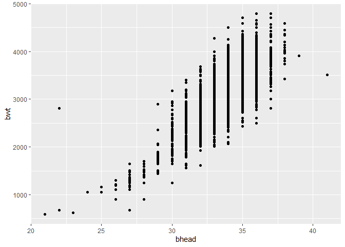<!-- -->

``` r
birthweight_df %>% 
  ggplot(aes(x = blength, y = bwt)) + 
  geom_point()
```

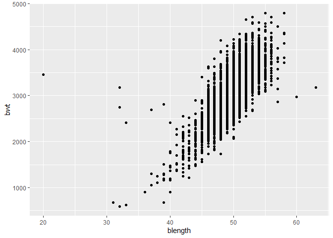<!-- -->

``` r
birthweight_df %>% 
  ggplot(aes(x = delwt, y = bwt)) + 
  geom_point()
```

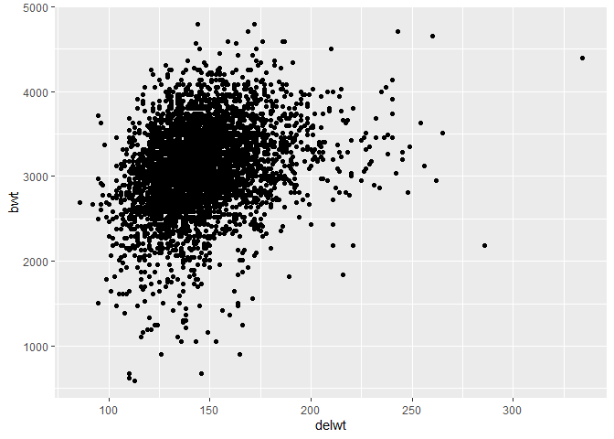<!-- -->

``` r
birthweight_df %>% 
  ggplot(aes(x = fincome, y = bwt)) + 
  geom_point()
```

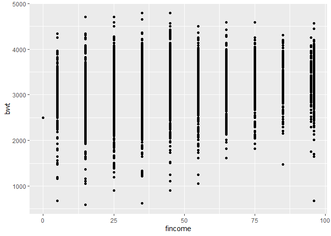<!-- -->

``` r
birthweight_df %>% 
  ggplot(aes(x = gaweeks, y = bwt)) + 
  geom_point()
```

<!-- -->

``` r
birthweight_df %>% 
  ggplot(aes(x = menarche, y = bwt)) + 
  geom_point()
```

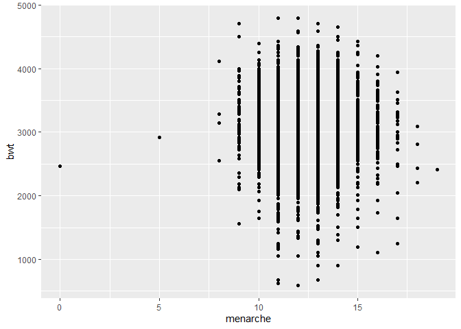<!-- -->

``` r
birthweight_df %>% 
  ggplot(aes(x = mheight, y = bwt)) + 
  geom_point()
```

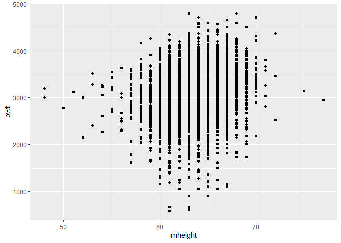<!-- -->

``` r
birthweight_df %>% 
  ggplot(aes(x = momage, y = bwt)) + 
  geom_point()
```

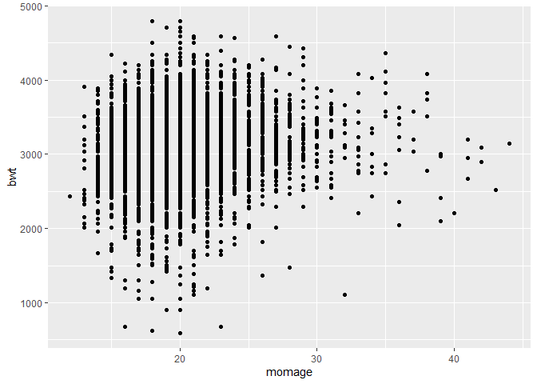<!-- -->

``` r
birthweight_df %>% 
  ggplot(aes(x = parity, y = bwt)) + 
  geom_point()
```

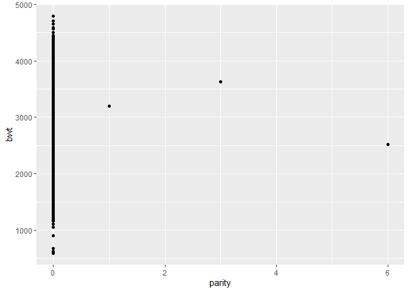<!-- -->

``` r
birthweight_df %>% 
  ggplot(aes(x = pnumlbw, y = bwt)) + 
  geom_point()
```

<!-- -->

``` r
birthweight_df %>% 
  ggplot(aes(x = pnumsga, y = bwt)) + 
  geom_point()
```

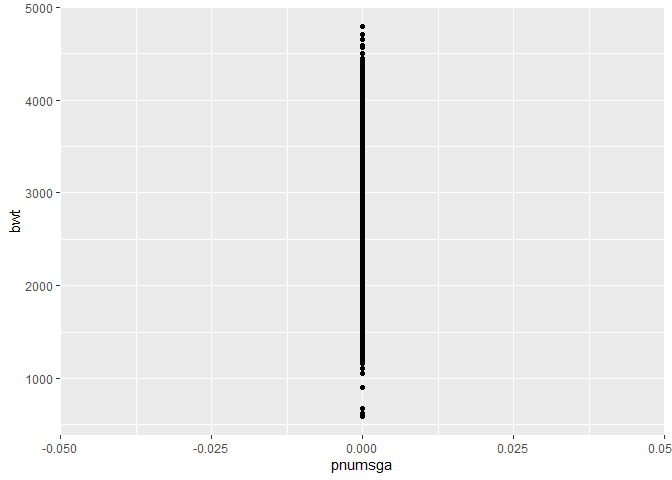<!-- -->

``` r
birthweight_df %>% 
  ggplot(aes(x = ppbmi, y = bwt)) + 
  geom_point()
```

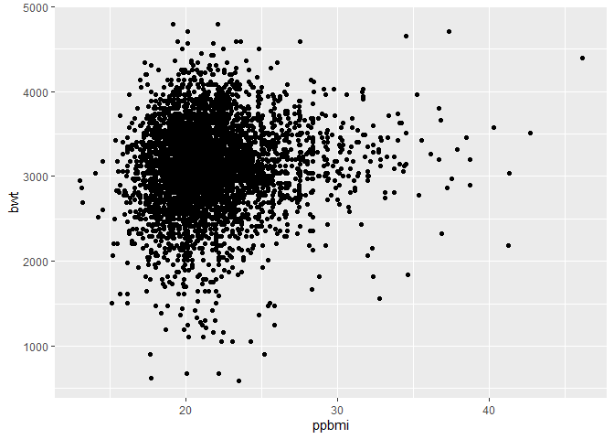<!-- -->

``` r
birthweight_df %>% 
  ggplot(aes(x = ppwt, y = bwt)) + 
  geom_point()
```

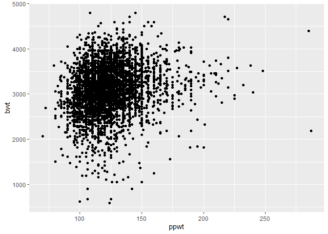<!-- -->

``` r
birthweight_df %>% 
  ggplot(aes(x = smoken, y = bwt)) + 
  geom_point()
```

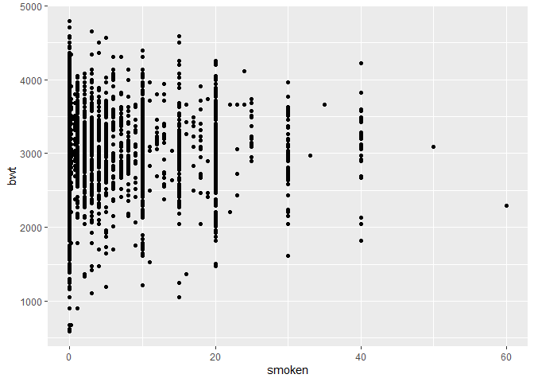<!-- -->

``` r
birthweight_df %>% 
  ggplot(aes(x = wtgain, y = bwt)) + 
  geom_point()
```

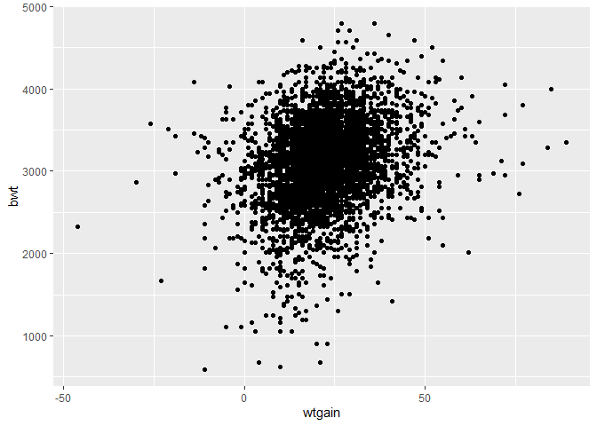<!-- -->

From the plots above we can infer that the birthweight is most related
to `bhead` and `blength`.

*Hypothesis testing*

``` r
fit_null1 = lm(bwt ~ bhead + blength, data = birthweight_df)
fit_alt1 = lm(bwt ~ bhead + blength + delwt, data = birthweight_df)

anova(fit_null1, fit_alt1) %>% 
  broom::tidy()
```

    ## # A tibble: 2 x 6
    ##   res.df        rss    df    sumsq statistic   p.value
    ##    <dbl>      <dbl> <dbl>    <dbl>     <dbl>     <dbl>
    ## 1   4339 362831534.    NA      NA        NA  NA       
    ## 2   4338 354026448.     1 8805086.      108.  5.56e-25

``` r
fit_null2 = lm(bwt ~ bhead + blength, data = birthweight_df)
fit_alt2 = lm(bwt ~ bhead + blength + fincome, data = birthweight_df)

anova(fit_null2, fit_alt2) %>% 
  broom::tidy()
```

    ## # A tibble: 2 x 6
    ##   res.df        rss    df    sumsq statistic   p.value
    ##    <dbl>      <dbl> <dbl>    <dbl>     <dbl>     <dbl>
    ## 1   4339 362831534.    NA      NA       NA   NA       
    ## 2   4338 357878582.     1 4952952.      60.0  1.15e-14

``` r
fit_null3 = lm(bwt ~ bhead + blength, data = birthweight_df)
fit_alt3 = lm(bwt ~ bhead + blength + gaweeks, data = birthweight_df)

anova(fit_null3, fit_alt3) %>% 
  broom::tidy()
```

    ## # A tibble: 2 x 6
    ##   res.df        rss    df    sumsq statistic   p.value
    ##    <dbl>      <dbl> <dbl>    <dbl>     <dbl>     <dbl>
    ## 1   4339 362831534.    NA      NA       NA   NA       
    ## 2   4338 355164031.     1 7667503.      93.7  6.26e-22

``` r
fit_null4 = lm(bwt ~ bhead + blength, data = birthweight_df)
fit_alt4 = lm(bwt ~ bhead + blength + menarche, data = birthweight_df)

anova(fit_null4, fit_alt4) %>% 
  broom::tidy()
```

    ## # A tibble: 2 x 6
    ##   res.df        rss    df   sumsq statistic p.value
    ##    <dbl>      <dbl> <dbl>   <dbl>     <dbl>   <dbl>
    ## 1   4339 362831534.    NA     NA      NA     NA    
    ## 2   4338 362623718.     1 207816.      2.49   0.115

``` r
fit_null5 = lm(bwt ~ bhead + blength, data = birthweight_df)
fit_alt5 = lm(bwt ~ bhead + blength + mheight, data = birthweight_df)

anova(fit_null5, fit_alt5) %>% 
  broom::tidy()
```

    ## # A tibble: 2 x 6
    ##   res.df        rss    df    sumsq statistic   p.value
    ##    <dbl>      <dbl> <dbl>    <dbl>     <dbl>     <dbl>
    ## 1   4339 362831534.    NA      NA       NA   NA       
    ## 2   4338 357790035.     1 5041499.      61.1  6.68e-15

``` r
fit_null6 = lm(bwt ~ bhead + blength, data = birthweight_df)
fit_alt6 = lm(bwt ~ bhead + blength + momage, data = birthweight_df)

anova(fit_null6, fit_alt6) %>% 
  broom::tidy()
```

    ## # A tibble: 2 x 6
    ##   res.df        rss    df    sumsq statistic  p.value
    ##    <dbl>      <dbl> <dbl>    <dbl>     <dbl>    <dbl>
    ## 1   4339 362831534.    NA      NA       NA   NA      
    ## 2   4338 359997579.     1 2833954.      34.1  5.48e-9

``` r
fit_null7 = lm(bwt ~ bhead + blength, data = birthweight_df)
fit_alt7 = lm(bwt ~ bhead + blength + parity, data = birthweight_df)

anova(fit_null7, fit_alt7) %>% 
  broom::tidy()
```

    ## # A tibble: 2 x 6
    ##   res.df        rss    df   sumsq statistic p.value
    ##    <dbl>      <dbl> <dbl>   <dbl>     <dbl>   <dbl>
    ## 1   4339 362831534.    NA     NA      NA    NA     
    ## 2   4338 362555330.     1 276204.      3.30  0.0691

``` r
fit_null8 = lm(bwt ~ bhead + blength, data = birthweight_df)
fit_alt8 = lm(bwt ~ bhead + blength + pnumlbw, data = birthweight_df)

anova(fit_null8, fit_alt8) %>% 
  broom::tidy()
```

    ## # A tibble: 2 x 6
    ##   res.df        rss    df sumsq statistic p.value
    ##    <dbl>      <dbl> <dbl> <dbl>     <dbl>   <dbl>
    ## 1   4339 362831534.    NA    NA        NA      NA
    ## 2   4339 362831534.     0     0        NA      NA

``` r
fit_null10 = lm(bwt ~ bhead + blength, data = birthweight_df)
fit_alt10 = lm(bwt ~ bhead + blength + ppbmi, data = birthweight_df)

anova(fit_null10, fit_alt10) %>% 
  broom::tidy()
```

    ## # A tibble: 2 x 6
    ##   res.df        rss    df   sumsq statistic p.value
    ##    <dbl>      <dbl> <dbl>   <dbl>     <dbl>   <dbl>
    ## 1   4339 362831534.    NA     NA      NA    NA     
    ## 2   4338 362349742.     1 481792.      5.77  0.0164

``` r
fit_null11 = lm(bwt ~ bhead + blength, data = birthweight_df)
fit_alt11 = lm(bwt ~ bhead + blength + ppwt, data = birthweight_df)

anova(fit_null11, fit_alt11) %>% 
  broom::tidy()
```

    ## # A tibble: 2 x 6
    ##   res.df        rss    df    sumsq statistic   p.value
    ##    <dbl>      <dbl> <dbl>    <dbl>     <dbl>     <dbl>
    ## 1   4339 362831534.    NA      NA       NA   NA       
    ## 2   4338 359602295.     1 3229239.      39.0  4.75e-10

``` r
fit_null12 = lm(bwt ~ bhead + blength, data = birthweight_df)
fit_alt12 = lm(bwt ~ bhead + blength + smoken, data = birthweight_df)

anova(fit_null12, fit_alt12) %>% 
  broom::tidy()
```

    ## # A tibble: 2 x 6
    ##   res.df        rss    df   sumsq statistic p.value
    ##    <dbl>      <dbl> <dbl>   <dbl>     <dbl>   <dbl>
    ## 1   4339 362831534.    NA     NA      NA    NA     
    ## 2   4338 362325760.     1 505774.      6.06  0.0139

``` r
fit_null13 = lm(bwt ~ bhead + blength, data = birthweight_df)
fit_alt13 = lm(bwt ~ bhead + blength + wtgain, data = birthweight_df)

anova(fit_null13, fit_alt13) %>% 
  broom::tidy()
```

    ## # A tibble: 2 x 6
    ##   res.df        rss    df    sumsq statistic   p.value
    ##    <dbl>      <dbl> <dbl>    <dbl>     <dbl>     <dbl>
    ## 1   4339 362831534.    NA      NA       NA   NA       
    ## 2   4338 355943583.     1 6887951.      83.9  7.67e-20

``` r
fit_null14 = lm(bwt ~ bhead + blength, data = birthweight_df)
fit_alt14 = lm(bwt ~ bhead + blength + pnumsga, data = birthweight_df)

anova(fit_null14, fit_alt14) %>% 
  broom::tidy()
```

    ## # A tibble: 2 x 6
    ##   res.df        rss    df sumsq statistic p.value
    ##    <dbl>      <dbl> <dbl> <dbl>     <dbl>   <dbl>
    ## 1   4339 362831534.    NA    NA        NA      NA
    ## 2   4339 362831534.     0     0        NA      NA

Since we can reject the null hypothesis only when p.value is extremly
small, from the anova outcome above we can learn that `bhead`,
`blength`, `delwt`, `fincome`, `gaweeks`, `mheigth`, `momage`, `ppwt`,
`wtgain` are related to birthweight(bwt).

*Found the model and show a plot of model residuals against fitted
values*

``` r
model_1 = lm(bwt ~ bhead + blength + delwt + fincome + gaweeks + mheight + momage + ppwt + wtgain, data = birthweight_df) 

bwt_res_pred_df_1 = 
  birthweight_df %>% 
  modelr::add_predictions(model_1) %>% 
  modelr::add_residuals(model_1) 

  bwt_res_pred_df_1 %>% 
  ggplot(aes(y = resid, x = pred)) + 
  geom_point() +
  geom_smooth(se = F, method = lm)
```

    ## `geom_smooth()` using formula 'y ~ x'

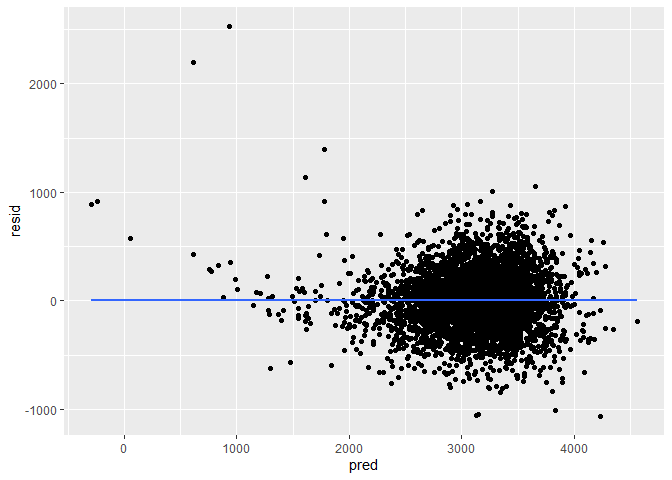<!-- -->

*Cross Validitation to compare the 3 models.*

``` r
cv_df = crossv_mc(birthweight_df, 100) %>% 
  mutate(
    model_1 = map(train, ~lm(bwt ~ bhead + blength + delwt + fincome + gaweeks + mheight + momage + ppwt + wtgain, data = .x)),
    model_2 = map(train, ~lm(bwt ~ blength + gaweeks, data = .x)),
    model_3 = map(train, ~lm(bwt ~ bhead + blength + babysex + 
               bhead * blength + bhead * babysex + blength * babysex + 
               bhead * blength * babysex, data = .x))
  ) %>% 
  mutate(
    rmse_model_1 = map2_dbl(model_1, test, ~rmse(model = .x, data = .y)),
    rmse_model_2 = map2_dbl(model_2, test, ~rmse(model = .x, data = .y)),
    rmse_model_3 = map2_dbl(model_3, test, ~rmse(model = .x, data = .y)))

cv_df %>% 
  select(starts_with("rmse")) %>% 
  pivot_longer(
    everything(),
    names_to = "model", 
    values_to = "rmse",
    names_prefix = "rmse_") %>% 
  mutate(model = fct_inorder(model)) %>% 
  ggplot(aes(x = model, y = rmse)) + geom_violin()
```

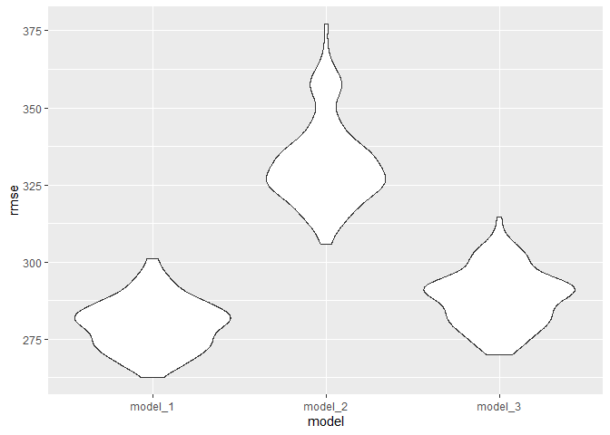<!-- -->
Among these 3 models, the model I built above (model_1) has the least
rmse in total, which means this model is the better one compared to the
other 2 given in the problem.

## Problem 2

``` r
weather_df = 
  rnoaa::meteo_pull_monitors(
    c("USW00094728"),
    var = c("PRCP", "TMIN", "TMAX"), 
    date_min = "2017-01-01",
    date_max = "2017-12-31") %>%
  mutate(
    name = recode(id, USW00094728 = "CentralPark_NY"),
    tmin = tmin / 10,
    tmax = tmax / 10) %>%
  select(name, id, everything())
```

    ## Registered S3 method overwritten by 'hoardr':
    ##   method           from
    ##   print.cache_info httr

    ## using cached file: C:\Users\Lenovo\AppData\Local/Cache/R/noaa_ghcnd/USW00094728.dly

    ## date created (size, mb): 2021-10-03 14:34:51 (7.614)

    ## file min/max dates: 1869-01-01 / 2021-09-30

*Using bootstrap to get the sample*

``` r
sample_df = 
  function(df) {
  sample_frac(df, size = 1, replace = TRUE)
}

boot_strap_df = 
  tibble(
    strap_number = 1:5000,
    strap_sample = rerun(5000, sample_df(weather_df))
  )
```

*r^2*

``` r
adj_r_square_df = 
  boot_strap_df %>% 
  mutate(
    models = map(.x = strap_sample, ~lm(tmax ~ tmin, data = .x)),
    glance = map(models, broom::glance)
  ) %>% 
  select(strap_number, glance) %>% 
  unnest(glance)

ci_r_square = 
  adj_r_square_df %>% 
  summarize(
    ci_lower = quantile(adj.r.squared, 0.025), 
    ci_upper = quantile(adj.r.squared, 0.975)) %>% 
  round(digits = 2)

adj_r_square_df
```

    ## # A tibble: 5,000 x 13
    ##    strap_number r.squared adj.r.squared sigma statistic   p.value    df logLik
    ##           <int>     <dbl>         <dbl> <dbl>     <dbl>     <dbl> <dbl>  <dbl>
    ##  1            1     0.898         0.897  3.08     3185. 8.83e-182     1  -928.
    ##  2            2     0.913         0.913  2.93     3833. 5.33e-195     1  -910.
    ##  3            3     0.902         0.901  2.99     3332. 5.64e-185     1  -917.
    ##  4            4     0.904         0.904  3.08     3410. 1.23e-186     1  -928.
    ##  5            5     0.920         0.920  2.82     4188. 2.07e-201     1  -896.
    ##  6            6     0.904         0.903  3.03     3403. 1.79e-186     1  -921.
    ##  7            7     0.917         0.917  2.89     4023. 1.68e-198     1  -905.
    ##  8            8     0.919         0.919  2.84     4125. 2.65e-200     1  -899.
    ##  9            9     0.915         0.915  2.90     3928. 8.83e-197     1  -905.
    ## 10           10     0.906         0.906  2.96     3508. 1.20e-188     1  -913.
    ## # ... with 4,990 more rows, and 5 more variables: AIC <dbl>, BIC <dbl>,
    ## #   deviance <dbl>, df.residual <int>, nobs <int>

``` r
adj_r_square_df %>% 
  ggplot(aes(x = adj.r.squared)) +
  geom_density() +
  labs(
        title = "Distribution of R Squared",
        x = "R Squared"
    ) +
  theme(plot.title = element_text(hjust = 0.5))
```

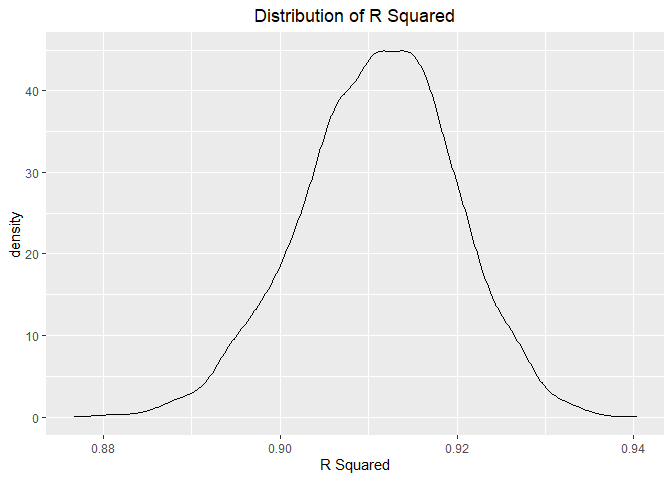<!-- --> The
distribution of `r^2` approximately follows a normal distribution, with
a center around 0.91. The 95% confidence interval for r-squared
distribution is 0.89, 0.93.

*log(B0 B1) *

``` r
log_df = 
    boot_strap_df %>% 
  mutate(
    models = map(.x = strap_sample, ~lm(tmax ~ tmin, data = .x)),
    results = map(models, broom::tidy)
  ) %>% 
  select(strap_number, results) %>% 
  unnest(results) %>% 
  select(term, estimate) %>% 
  pivot_wider(
    names_from = term,
    values_from = estimate
    ) %>% 
  unnest(cols = c(`(Intercept)`, tmin)) %>% 
  rename(B0 = "(Intercept)",
         B1 = tmin) %>% 
  mutate(value = log(B0 * B1))

ci_log = 
  log_df %>% 
  summarize(
    ci_lower = quantile(value, 0.025), 
    ci_upper = quantile(value, 0.975)) %>% 
  round(digits = 2)

log_df
```

    ## # A tibble: 5,000 x 3
    ##       B0    B1 value
    ##    <dbl> <dbl> <dbl>
    ##  1  7.54  1.02  2.04
    ##  2  6.86  1.06  1.99
    ##  3  7.55  1.02  2.04
    ##  4  7.24  1.03  2.01
    ##  5  6.89  1.06  1.99
    ##  6  7.15  1.06  2.02
    ##  7  7.20  1.04  2.02
    ##  8  7.26  1.04  2.02
    ##  9  7.19  1.05  2.03
    ## 10  7.34  1.04  2.03
    ## # ... with 4,990 more rows

``` r
log_df %>% 
  ggplot(aes(x = value)) +
  geom_density() +
  labs(
        title = "Distribution of log(B0 * B1)",
        x = "log(B0*B1)"
    ) +
  theme(plot.title = element_text(hjust = 0.5))
```

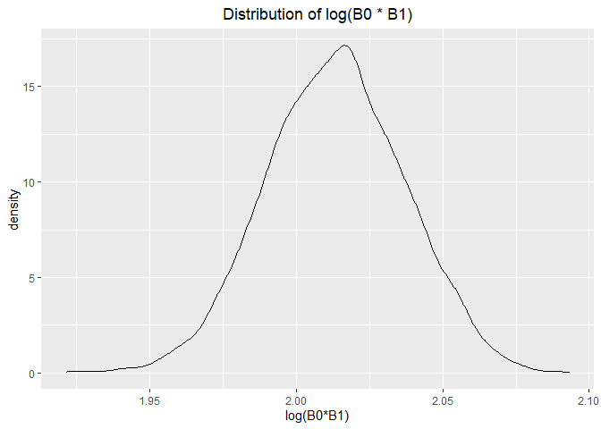<!-- -->
The log function plot generally follows a normal distribution, with a
center around 2.01. The confidence interval of the log function is 1.97,
2.06.
